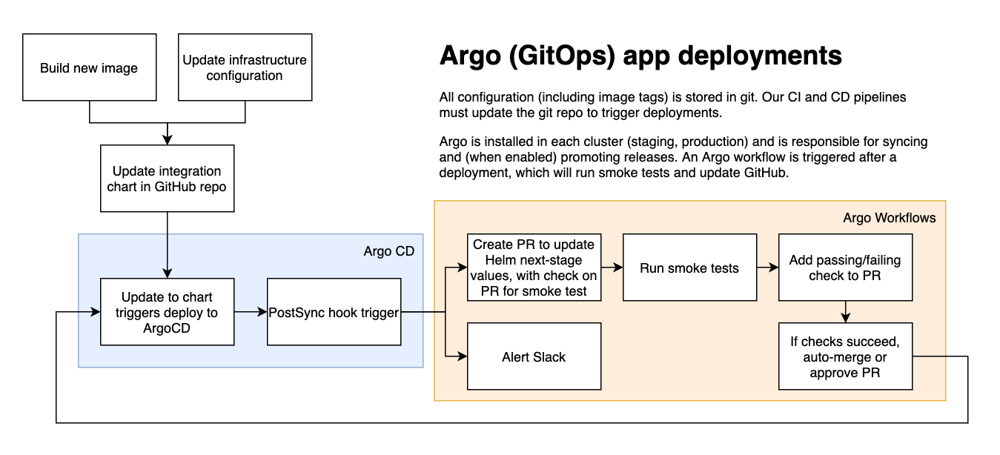

# 10. Use Argo for continuous delivery (CD)

Date: 2021-10-11

## Status

Accepted

## Context

We want to be able to deploy applications to Kubernetes using [GitOps], so that
all configuration is stored as code in a git repository.
We also want to support existing features of the GOV.UK platform such as
[continuous deployment] with smoke tests.

We evaluated several solutions:

* Argo
* FluxCD
* Spinnaker
* Concourse
* Jenkins X

Concourse and Spinnaker are not Kubernetes-native, and aren't primarily GitOps
tools, with imperative deploy pipelines.
Jenkins X seemed more geared towards CI support.

Argo and Flux are very similar.
We liked Argo since Argo CD and Workflows will enable us to replicate our current
platform's functionality.
In particular Argo seems to have better support than Flux for those imperative
steps of deploy pipelines such as smoke tests (required for continuous deployment).
Argo's additional projects (Rollouts and Events) may be useful in future.

## Decision

Use [Argo](https://argoproj.github.io/).

## Consequences

Can be installed via [a Helm chart](https://artifacthub.io/packages/helm/bitnami/external-dns).

GitOps enables easier disaster recovery, as all configuration will be stored as
code.

We will make use of `PostSync` [resource hooks] to promote releases (shown below).

[GitOps]: https://www.weave.works/technologies/gitops/
[continuous deployment]: https://www.atlassian.com/continuous-delivery/continuous-deployment
[resource hooks]: https://argo-cd.readthedocs.io/en/stable/user-guide/resource_hooks/
