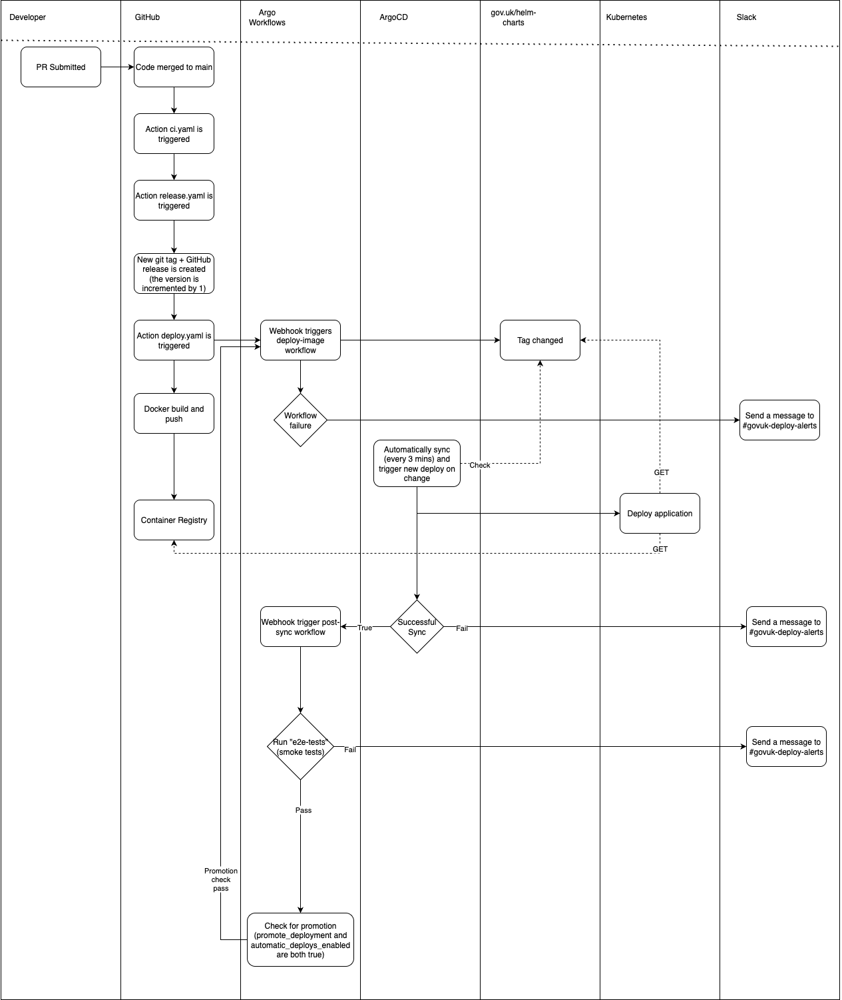

# 18. Use Concourse CI

Date: 2025-08-12

## Status

Accepted

## Context
<!--
  Describe the problem being solved.
  Describe the context in which the decision is being made.
  Describe any relevant research that was conducted.
  Describe any other decisions that could have been made, and why we didn't make them.
-->

We have a continuous integration and continuous delivery (CI/CD) system composed of GitHub Actions workflows, ArgoCD 
deployments and Argo Workflow runs. When a pull request is merged into `main` in an application's source repository, 
a GitHub Actions workflow is triggered which builds a container image and instructs ArgoCD in the staging Kubernetes 
cluster to deploy it. On success, the staging cluster triggers the same action in the production cluster.

An IT Health Check that was carried out in 2024 identified security flaws in the implementation of the deployment process. 
This, along with a number of incidents directly caused by this process, and the team's ongoing issues with Argo Workflows 
has led us to wish to re-engineer our CI/CD pipelines used for GOV.UK applications.

An additional, contributing factor for making the decision was [ADR 0014](./0014-replace-terraform-cloud.md), in which we
decided we would move away from Terraform Cloud. To do so will require us to have a replacement for automatically applying
Terraform code in different environments.

### Research

We held a team design day to discuss our CI/CD pains and come up with next steps for addressing them. The major outcomes 
of that day were decisions to investigate two different tools: Kargo and Concourse.

#### Kargo
[Kargo](https://kargo.io/) bills itself as a "multi-stage GitOps continuous promotion" tool.  In short, it can take an
artifact, deploy it in one place, validate it (e.g. via tests), and promote it to the next place and so on, in an 
automated fashion. That behaviour matched precisely what our existing workflow does across clusters, so we decided to
attempt to replicate what we have using Kargo.

We planned to build a workflow that ran on a mock production Kubernetes cluster and orchestrated deployments to both a 
mock staging cluster and itself. Kargo is able to do it, but it relies on a feature called sharding. Sharding is available
in the free OSS version of Kargo, but its maintainers have said publicly that they [intend not to document it fully](https://github.com/akuity/kargo/issues/2447#issuecomment-3009092623), favouring driving those that need it [toward their commercial offering](https://github.com/akuity/kargo/issues/4633#issuecomment-3176727119).

We did not want to rely on undocumented features, so we opted to prototype a workaround for the problem using Argo Rollouts
to see how it would look and feel. The workaround worked, but it effectively disabled the deployment validation function 
of Kargo, and for that reason we decided it was not a good choice.

We ultimately decided that Kargo was not a good fit for what we wanted to do because the features we needed to make it work
were intentionally left undocumented by the maintainers to encourage commercial adoption, and the workarounds were no good. 

#### Concourse
[Concourse](https://concourse-ci.org/) is a "continuous thing-doer". It is generally unopinionated, and functions as a 
flexible task runner based on OCI container images with YAML configuration of pipelines. It is not explicitly for 
deploying applications, but its flexibility allows it to be configured for that purpose with ease.

We decided to experiment with Concourse by replicating our existing workflow, just as we did with Kargo, so that we could 
experience how it felt to use and deploy.

We deployed mock production and staging Concourse instances, along with mock production and staging Kubernetes clusters. 
We then built out a parameterised pipeline that was triggered by a git commit, and subsequently built, deployed, 
validated, and promoted a container image. 

We did not find any show-stopping problems in using Concourse. We experienced some friction and a learning curve, but
nothing we felt was insurmountable or constituted a bad experience.

Our final recommendation was that we should take the next steps in replacing our CI/CD system using Concourse.

## Decision

<!--
  Describe the decision we have made.
  Describe the justifications for making this decision.
  Describe any trade-offs we've made.
-->

After playing back both investigations into Kargo and Concourse, the team decided to pursue Concourse as its CI/CD tool
of choice. 

In our research we deployed it on virtual machines in EC2, because that is what was done by the Terraform code we borrowed.
We discussed the implications for us of running EC2 instances versus running Concourse in the Kubernetes clusters, and 
we decided that we should stay away from running virtual machines because it adds additional infrastructure for us to
support long term, which is different from everything else we support.

By adopting Concourse over a combination of GitHub Actions, ArgoCD, and Argo Workflows we are trading a deployment system
we have intimate knowledge of, but is complex and fragile, for adopting and maintaining a new tool which we believe can 
simplify and make the process more reliable

## Consequences

<!--
  Describe the impacts and side effects of the decision we have made.
  Describe the impacts and side effects on both the team and the systems we operate.
  Include both the good and the bad consequences.
-->

As a consequence of our decision to adopt Concourse, we have two unanswered questions:

1. In what architecture will we deploy it?
2. How will we write the pipelines?

Both of these questions will, when answered, receive ADRs of their own.

Another consequence of our choice is its impact on the developer teams who rely upon us, and our CI/CD systems. Once we 
know more about what we will be changing and how, we will need to write a lot of new documentation and engage with teams
directly to teach them about the changes we're making.

We expect that a switch over to Concourse will not be done all in one go. This means that we will double our maintenance
costs for a period of time, and that our support burden will increase while we have teams using both systems. These costs
will reduce once we have finished moving to Concourse.

