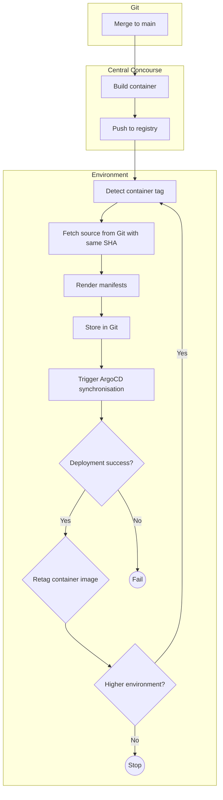

# 19. Restructure CI/CD

Date: 2025-10-16

## Status

Accepted

## Context

This ADR aims to document the Platform Engineering team's goal state for the process applications(and the platform 
itself) go through to get from source code to a production system. Most of the thinking and debate over this has 
happened between June 2025 and October 2025, in various documents, conversations, and team meetings. The final structure
we are documenting here is the product of team design sessions on 15th October 2025.

### The problem

In June 2024 we had an IT Health Check conducted that flagged some critical vulnerabilities in the fundamental 
architecture of our CI/CD processes. In April 2025, we also carried out some user research with the application teams, 
our senior management team, and ourselves to learn about the pain points involved with our current setup.

The nature of the vulnerabilities and the specific things we learned from the research are out of scope here. However, 
between those two data points, our own generalised dissatisfaction, and our decision to [replace Terraform Cloud](./0014-replace-terraform-cloud.md)
we felt that a total rework would be the best option.

### Technology choice

In the lead up to making the decisions documented here, we went through a small number of investigations to select
the technologies we wanted to use. We did this knowing from experience that we would be able to solve the problems we
would need to solve using whatever technologies we chose.

The researched culminated in us [deciding to use Concourse CI](./0018-use-concourse-ci.md) as our CI/CD tool of choice.

At this time of writing, there is ongoing research into the tool we should select for YAML generation. A subsequent
ADR will cover that choice.

## Inputs into the decision-making process

In the run-up to the team design session on 15th October 2025, we put together a number of documents whose contents
would feed into how we evaluated our options.

Firstly we wrote down what we felt to be our [core principles of secure CI/CD](https://docs.google.com/document/d/1P4ZNrY2N4sq_XtVmPZLFjiYQ6L-dSeNzrr7sONPK6zo/edit?usp=sharing).
These principles describe the properties that any solution we come up with must have. We used them to help us
evaluate the options in front of us, and we intend to use them in the future to evaluate changes and additions.

Second we wrote down what we felt should be [the guiding ideas for what we want the GOV.UK platform to become](https://docs.google.com/document/d/1PiJmHrmFWI98PydSY2Jq4UWHh3PuwZITkmHnQc-UzjY/edit?tab=t.0#heading=h.jahzhj4gax23).
Expressing these ideas in writing and reviewing them together helped us all get on the same page about what it should
be to use our platform at a high level. Consensus on that will in turn guide the decisions we make.

<!-- vale RedHat.PassiveVoice = NO -->
The final document we produced as input showed [the possible ways we could deploy Concourse](https://docs.google.com/document/d/1odUWlmmgVXlb5PlveA7j_jAbwlgsCb8zyKEIP472XvI/edit?tab=t.0).
We used this to focus our discussions, and the options it presented are summarised for posterity in the next section.
<!-- "are summarised" is a valid use of the passive voice in this context -->
<!-- vale RedHat.PassiveVoice = YES -->

## Options

### Option 1: Concourse on EC2

Under option 1 we would run Concourse on EC2 instances, either in each environment or as a central management cluster.
This is how the GOV.UK Pay team runs Concourse, and we would be able to crib a lot of code from them to get started.

We immediately dismissed this option because EC2 is not a service we use directly elsewhere. We would have to do a lot 
of work to build out and maintain the Concourse infrastructure in comparison to running it in Kubernetes.

### Option 2: Concourse on Kubernetes in a management cluster

Under option 2 we would create a new AWS account, and in it a new Kubernetes cluster. That cluster would run the
Concourse web node and a number of worker nodes.

To perform deployments, the workers would require privilege enough to reach into other environments.

Going down this route would give us a single place to run deployments from, which would make it easy to see the state of
any deployment across all environments. It would also give us a convenient place to run the types of jobs that aren't
related to one environment, such as configuring GitHub access.

It would also present all the risks associated with crossing the already established security boundaries around the
existing environments, and its level of privilege would make it an obvious target for attackers.

From a reliability perspective, a management cluster in control of deployments to all environments represents a large
single point of failure.

### Option 3: Concourse in each application cluster

Under option 3 we would run the Concourse web node and its workers directly on the Kubernetes cluster in each
environment. It would be responsible for, and have permission to, deploy to the environment in which it runs.

Choosing option 3 would give us good separation between the environments, but would present additional maintenance
burden. It also does not address the needs of development teams to see the state of their deployments across all
environments in a single place.

### Option 4: Separate infrastructure and application Concourses per environment

Option 4 is very similar to option 3, but we would have a separate Concourse deployments for infrastructure changes and
application changes. This would further separate the levels of privilege needed, but would contribute further to the
maintenance burden.

### Option 5: One Concourse on one cluster with all the environments

<!-- vale RedHat.PassiveVoice = NO -->
Option 5 was brought up and discussed briefly on the team day on 15th October 2025. The proposal would be to begin
deploying teams' staging and integration applications into the production cluster, with suitable isolation and security
controls.
<!-- "was brought up" is a valid use of passive voice here -->
<!-- vale RedHat.PassiveVoice = YES -->

The platform engineering team would maintain integration and staging clusters for the purposes of developing and testing
changes to the platform, but the applications running on them would be synthetic ones.

The effect of this change would be to turn the production cluster into _the platform_. This is similar to the way that 
users of Heroku deploy all of their development, staging, and production code into Heroku's production system.

## Decision

The decision we have landed on is a blend between options 2 and 3. We will have a Concourse deployment in each
environment, with a central Concourse deployment in a "tools" account or similar. The central Concourse will not
have permission to reach into other accounts.

<!-- vale PlatformEngineering.AsConjunction = NO -->
The Concourse deployment in each environment will, as in option 3, be responsible for deployments to the environment
that it lives in.
<!-- "as in" is a similie, not a conjuction -->
<!-- vale PlatformEngineering.AsConjunction = YES -->

The central "tools" Concourse deployment however has a different purpose.

### The role of a central Concourse

During the team's discussions, we noted that under option 3 we would need to rebuild any artifacts at the beginning of
each run. Conceptually this should be OK because the artifacts we build are reproducible, and running the build
twice should always result in the same output. However, we noted that we have seen that this is not the case in
practice on a number of occasions, across a number of applications in recent memory.

We believe the cause was Ruby On Rails' asset pre-compilation being flaky. We have observed that in most cases the
built container image correctly includes assets, but in a few unpredictable cases the process that generates them fails,
but the build continues. Therefore, increasing the number of builds taking place during a deployment will increase the 
number of instances of bad artifact builds.

As a team we briefly considered bringing the failures up with the relevant team and working with them to fix it. However,
we realised that every team that uses Ruby On Rails can experience the problem, because the issue is with Rails' asset 
pre-compilation.

We instead settled on the fact that we must build the artifacts a single time at the beginning of a deployment, verify 
them, and reuse them across environments. This is the same behaviour as in our existing system, where we build the 
artifacts in GitHub Actions.

We decided we did not want to continue with GitHub Actions building our artifacts because we find it to be too slow and
unreliable for that purpose. We instead decided to introduce a central Concourse deployment, on which the artifact
builds could take place.

Introducing a central Concourse deployment for this purpose has a couple of useful benefits.
1. We can have dedicated machines for fast artifact builds
2. It provides us a convenient place to run the kinds of jobs that do not relate to a specific environment.

### Versioning infrastructure manifests

A secondary decision that we made during the team discussions on October 15th 2025 was to begin versioning the manifest
files for application infrastructure, just as we do for application source code.

Currently, we use a Git repository called `govuk-helm-charts`. It holds our central `generic-govuk-app` Helm chart
code, and the values for all the applications that make use of it. When a new version of an application container
needs deploying, the process updates the repository to set the value in a file. ArgoCD subsequently detects the change,
renders the manifests, and synchronises the cluster with them. As a result of this, the repository has 190,000+ commits
at the time of writing.

In each environment, our pipelines will render manifest files in each application repository by using whatever technology
we select for YAML generation. We will store the rendered manifest files in a Git repository, which ArgoCD will 
synchronise from.

### Path to production

The decisions we have made about how we architect Concourse have a direct impact on how application code reaches
production. We expect that the process now looks like

1. Merge to `main`
2. Build container, tag with Git SHA, push to registry
3. Detect container tag in pipeline
4. Fetch source from Git at same SHA as container
5. Render manifests
6. Store in Git
7. Trigger ArgoCD synchronisation
8. Wait for deploy success/fail
9. If success, re-tag container image to indicate successful deployment
10. Go to 3 if there is a higher environment

## Consequences

### Time and energy

<!-- vale RedHat.TermsSuggestions = NO -->
To implement the decisions we have made we expect will require a large investment of time and energy, over the course of
at least a year. During that time we expect to have different applications reaching production in different ways, and
there to be some amount of confusion over which application is using which process. We accept this as a cost of doing
the rework.
<!-- "which ... is using which ..." is an OK use of "which" --> 
<!-- vale RedHat.TermsSuggestions = YES -->

Because of the long timeline, there is also a risk we will need to shelve the work part way through in favour of a
more urgent piece of work.

### Technical debt

Whilst we rework our CI/CD infrastructure, we know that we will have to make compromises and have messy code in
different parts of the system. This will inevitably pile up as technical debt. We will do our best to prevent this and
pay down debt as we go, but there is very likely to be some left over when we finish.

### Cost

There will be a minor rise in the cost of running each environment, and an additional cost for the new "tools" account.
In each environment we expect to run at least one new node in Kubernetes for Concourse, plus its database. In the new
account the costs will include a new Elastic Kubernetes Service cluster control plane on top of the nodes and database.

### Better security posture

We believe that the choices we have made regarding CI/CD architecture addresses the most critical of the findings of the
2024 ITHC. Addressing these findings leaves us with a much better security posture, and good base on which to layer
additional security controls at a later date.
