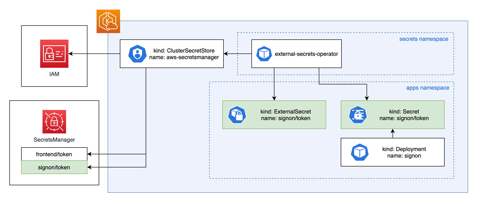

# Kubernetes external secrets

This project implements [external-secrets] as described in [Architectural Decision Record (ADR) 8].

AWS SecretsManager is the source of truth for most secrets.

## How are SecretsManager secrets accessed by applications in Kubernetes

The External Secrets Operator (ESO) creates Custom Resource Definitions (CRDs) such as `ClusterSecretStore`
and `ExternalSecret`. The `ClusterSecretStore` is not namespaced, and all namespaces use it.

The `ClusterSecretStore` is responsible for authenticating with AWS when we need
to manage a secret in SecretsManager. It holds references to secrets, which hold
credentials to access the SecretsManager API. The `ClusterSecretStore` called
`aws-secretsmanager` uses a short-lived Service Account token to authenticate
with AWS.

The ESO reconciles each `ExternalSecret` with secrets in AWS SecretsManager (using
credentials provided by `ClusterSecretStore`), and creates a `Secret` (and keeps the
Kubernetes Secret in sync with the SecretsManager Secret).

Application developers create an `ExternalSecret` when required for their apps,
and reference the associated Kubernetes Secret in the app's Helm deployment.

The platform team is responsible for providing the `ClusterSecretStore`. Service
teams are responsible for defining each `ExternalSecret` they need.

Not discussed here is how we add secrets to SecretsManager. It would be nice
if we could avoid having Terraform config for every SecretsManager secret, and
have this config live entirely in Kubernetes. But the lifecycle of secrets in
SecretsManager is not the responsibility of ESO, so we need to figure out how
to manage SecretsManager secrets. Also not discussed is how we'll rotate secrets,
this is also out of scope of the ESO.

[external-secrets]: https://external-secrets.io/
[ADR 8]: architecture/decisions/0008-use-external-secrets-for-secrets-storage.md